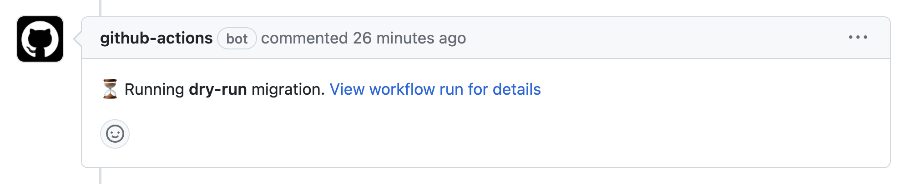
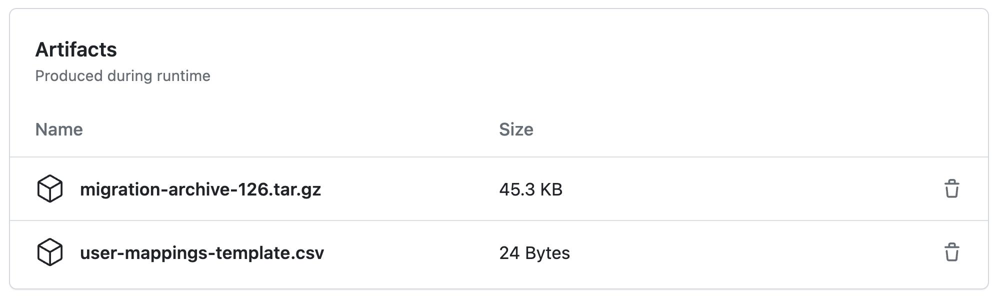

# Migrate to GitHub.com

This repository contains GitHub Actions workflows to migrate repositories from various sources to GitHub.com.

For setup instructions, see the [Setup Guide](SETUP_GUIDE.md).

## Repo Config
<!--
Paste repo setup configuration below.
Source can be one of GitHub Enterprise Server, GitLab, or GitHub.com.
Target can be one of GitHub Enterprise Cloud, GitHub Enterprise Cloud EMU, GitHub.com, or GitHub Enterprise Server.
!! Include links to your source and target for clarity !!
-->
This repo is configured as follows:
**Source:** [GitHub Enterprise Server](https://github.mycompany.com)
**Source Orgs:** [my-awesome-on-prem-org](https://github.mycompany.com/my-awesome-on-prem-org)
**Target:** [GitHub.com EMU](https://github.com/enterprises/my-enterprise/)
**Target Org:** [my-awesome-org](https://github.com/my-awesome-org)

## User Guide

## Step 1: Create an issue from template

Create an issue from template to specify source repositories.
Go to issues -> [New issue](./../../issues/new/choose)
Select the issue template depending on your source and target. If you are not sure which template to use, ask your GitHub administrator.

Specify repositories to migrate in issue's body.

> [!Tip]
> You can specify multiple repositories in one issue.

Specify the target repository visibility. The default is `private` if not specified. If you select `Mirror`, the target repository will have the same visibility as the source repository, with one exception: if the source repository is `public` the target repository will be `internal`.

## Step 2: Perform a dry-run migration

When migrating, a [dry-run migration is recommended](https://docs.github.com/en/enterprise-cloud@latest/migrations/overview/planning-your-migration-to-github#performing-a-dry-run-migration-for-every-repository) for every repository in order to:

1. Verify that the migration process works as expected
2. Understanding what data is migrated and what data is not in case any additional scripting is required
3. Obtain timing measurements for assisting in scheduling the production migration

A dry-run migration will not lock your source repository and therefore does not block your users from continuing to work on the source repository. Otherwise, a dry-run migration is identical to a production migration (it is not a what-if analysis).

Add the following comment to the issue to perform a dry-run migration:

```sh
/run-dry-run-migration
```

## Step 3: Verify migrated repository

Verify that migration was completed successfully.

In order to delete the migrated repositories of the dry-run, add a comment with the following command:

```sh
/delete-repositories <GUID>
```

## Step 4: Add users to user-mappings.csv file

The dry-run migration will create a `user-mappings-template.csv` file and add it to the build artifacts for the workflow run. To find this file, follow the link to the workflow run in the issue comment...  
  

Scroll to the bottom of the workflow summary page to find the artifacts...  
  

Download the `user-mappings-template.csv` file and add your target users to it. The file should have the following format:  

```csv
source,target
steffenhiller,steffen
```

If migrating with GitHub Enterprise Importer (GEI), the `user-mappings-template.csv` file should have following format:

```csv
mannequin-user,mannequin-id,target-user
steffenhiller,u0001,steffen
```

Merge your completed template file with `user-mappings.csv` file, or `user-mappings-gei.csv` file if using GEI. Create a pull request to this repository with additions to the appropriate file. After this file is merged to main, it will be used in future migrations, both dry-run and production, to map source users to target users.  

If migrating to GHES, the import workflow will generate a `conflicts.csv` file during the dry-run if the file does not already exist in the repo. This file will be uploaded as an artifact of the workflow run. You can modify this file and check it in to the root of this repo and it will be used to resolve conflicts on the next dry-run or production run.

### Group / Project Mapping into Orgs

When importing into GHES, there could be the need to map groups or projects into orgs. This can be done by adding the `org-mappings.csv` file to the root of this repo. The file should have the following format:

```csv
source,target
group1,org1
group1,org2
group1-subgroup1,org1
```

> [!NOTE]
> The `org-mappings.csv` file is only used when importing into GHES.

## Step 5: Perform production migration

After you have verified your dry-run migration and after you have announced the production migration to your users, create a comment with the following command to start the production migration:

```sh
/run-production-migration
```

It will [lock](https://docs.github.com/en/migrations/overview/about-locked-repositories) your source repository and make it **inaccessible** for your users.
